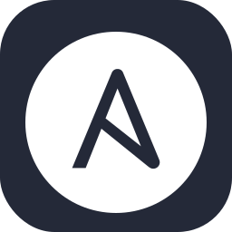

<!-- ### Hi there 👋 -->

<!--
**yoonhyunchan/yoonhyunchan** is a ✨ _special_ ✨ repository because its `README.md` (this file) appears on your GitHub profile.

Here are some ideas to get you started:

- 🔭 I’m currently working on ...
- 🌱 I’m currently learning ...
- 👯 I’m looking to collaborate on ...
- 🤔 I’m looking for help with ...
- 💬 Ask me about ...
- 📫 How to reach me: ...
- 😄 Pronouns: ...
- ⚡ Fun fact: ...
-->

⭐️ Hi, there! I'm Hyunchan Yoon :) 
I'm a student studying about Cloud & Devops

<!-- 🌱 I’m currently learning -->
<!-- 🌱 I want to be myself who does my best. -->
### 📞 contact & channel

  <table>
    <tr>
      <td style="width:256px;">
        
        
      </td>
    </tr>
  </table>

  
### 📚 Tech stack 

  
  
   
  
  
  
   
  
  
  
  
  
   
  

### 📘 Tech I've used at least once 

   
  
  
   
  
  
   
  
  
  
  

### 🎸 Now Interest 

  
  

### 🏅 Certifications

<b>AWS Certified Solutions Architect - Associate</b>
 

<b>Microsoft Certified: Azure AI Fundamentals</b>
---

